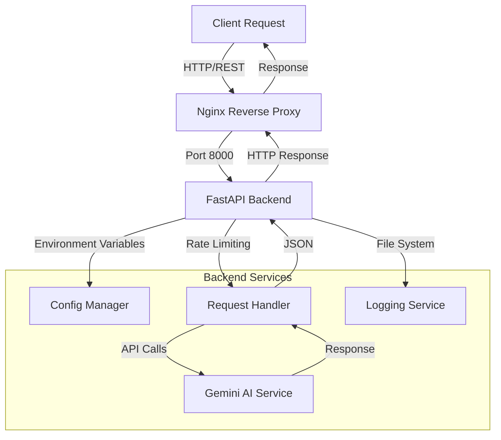
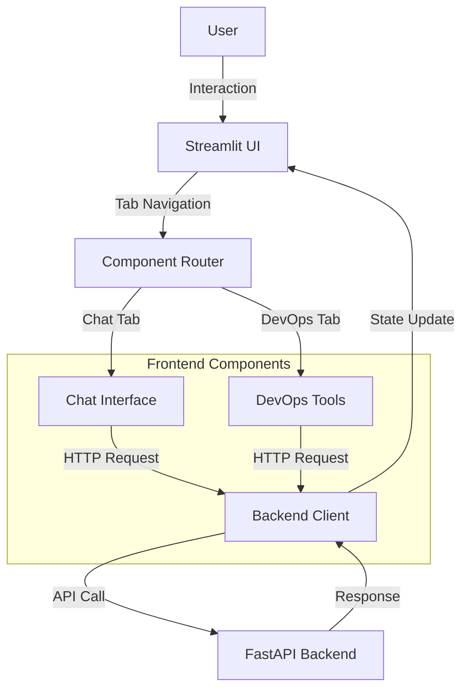
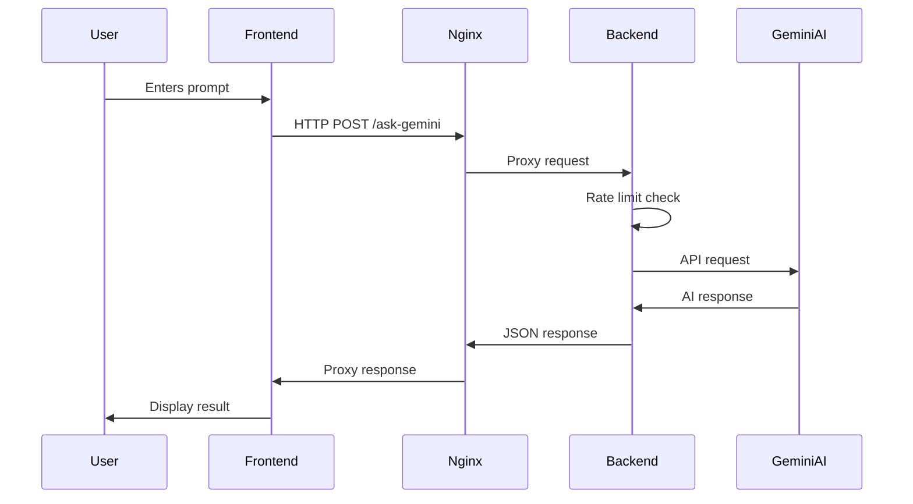

# Gemini AI Assistant Platform

A production-ready AI assistant platform built with FastAPI, Streamlit, and Google's Gemini AI. This platform provides both chatbot capabilities and specialized DevOps tooling through a modern web interface.

## Architecture Overview

### Backend Architecture


### Frontend Architecture


## Technical Stack

### Backend
- **Framework**: FastAPI
- **AI Service**: Google Gemini API
- **Container**: Docker
- **Proxy**: Nginx
- **Testing**: Pytest

### Frontend
- **Framework**: Streamlit
- **HTTP Client**: Requests
- **Container**: Docker
- **Testing**: Playwright

## File Structure
```
.
├── backend/
│   ├── Dockerfile           # Backend container configuration
│   ├── main.py             # FastAPI application entry point
│   └── requirements.txt     # Backend dependencies
├── frontend/
│   ├── Dockerfile          # Frontend container configuration
│   ├── streamlit_app.py    # Streamlit application
│   └── requirements.txt    # Frontend dependencies
├── tests/
│   ├── test_backend.py     # Backend unit tests
│   ├── test_frontend_ui.py # Frontend UI tests
│   └── test_e2e.py        # End-to-end integration tests
├── docker-compose.yml      # Container orchestration
├── .env.example           # Environment variables template
└── README.md              # Project documentation
```

## System Integration Flow



## Setup and Deployment

### Prerequisites
- Docker and Docker Compose
- Google Gemini API key
- Python 3.11+

### Local Development
1. Clone the repository:
```bash
git clone <repository-url>
cd gemini-platform
```

2. Create environment file:
```bash
cp .env.example .env
# Edit .env with your Gemini API key
```

3. Start services:
```bash
docker-compose up --build
```

### Production Deployment

1. Configure production environment:
```bash
cp .env.example .env.production
# Add production configuration
```

2. Build and deploy:
```bash
docker-compose -f docker-compose.yml up -d
```

3. Monitor logs:
```bash
docker-compose logs -f
```

## Security Considerations

- Rate limiting implemented
- CORS protection
- Environment variable security
- Docker security best practices
- Non-root container users
- Regular security updates

## Monitoring and Logging

- JSON formatted logs
- Log rotation configured
- Health check endpoints
- Docker healthchecks
- Resource monitoring

## Load Testing

The system is configured to handle:
- 60 requests per minute per client
- Automatic scaling with Docker
- Connection pooling
- Response caching

## Contributing

1. Fork the repository
2. Create feature branch
3. Commit changes
4. Push to branch
5. Create Pull Request
